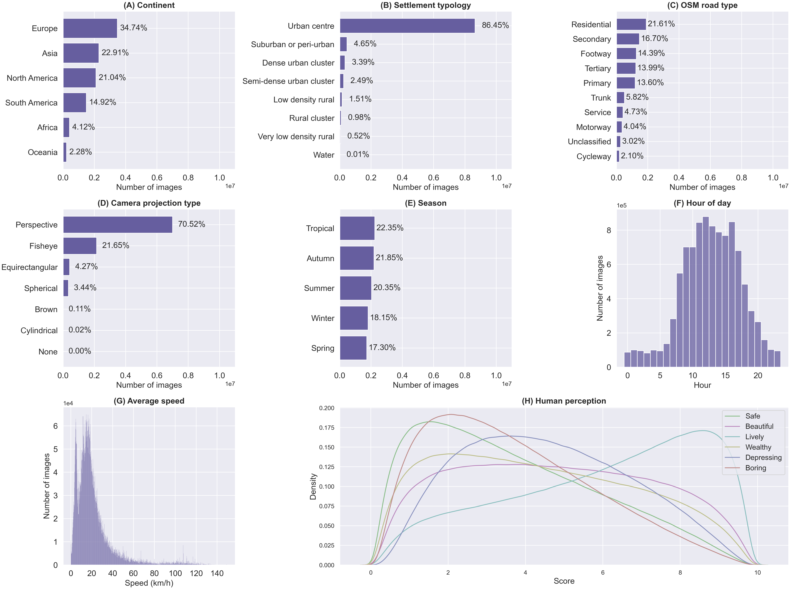

# Global Streetscapes
[](https://creativecommons.org/licenses/by-sa/4.0/)

Repository for all code used for download and processing of the NUS Global Streetscapes dataset, developed by the [Urban Analytics Lab (UAL)](https://ual.sg/) at the National University of Singapore (NUS).

You can read more on the [project website](https://ual.sg/project/global-streetscapes/) too.
The project website includes an overview of the project together with the background, [paper](https://www.sciencedirect.com/science/article/pii/S0924271624002612#d1e3239), FAQ, etc.


The journal paper can be found [here](https://www.sciencedirect.com/science/article/pii/S0924271624002612) and the dataset is hosted in [huggingface](https://huggingface.co/datasets/NUS-UAL/global-streetscapes).


**Global Streetscapes** is an open dataset made up of 10 million Street-View Images (SVIs) spanning 688 cities from 212 countries and regions, crowdsourced from [Mapillary](https://www.mapillary.com/) and [KartaView](https://kartaview.org/landing).
The map below shows the geographical coverage of the dataset.


Apart from their original metadata, each image has been enriched with a wide range of geospatial, temporal, contextual, semantic, and perceptual information adding up to 346 unique features, as shown in the below illustration.


The charts below illustrate the class or value distribution among the 10 million images for (A) continents covered, (B) settlement typology (degree of urbanisation), (C) OSM road type, (D) camera projection type, (E) season, (F) hour of the day, (G) transportation mode, and (H) perception scores



# Requirements

To install requirements for CV (computer vision) related tasks (`code/model_training`):

```
pip install -r requirements-cv-linux.txt
```

To install requirements for non-CV related tasks (`code/raw_download`, `code/download_imgs`, `code/enrichment`):

```
pip install -r requirements-non_cv.txt
```

# Getting started

Please visit our [data repository](https://huggingface.co/datasets/NUS-UAL/global-streetscapes) to download the dataset.
[`info.csv`](https://huggingface.co/datasets/NUS-UAL/global-streetscapes/blob/main/info.csv) outlines the meaning of each variable in this dataset.

We recommend you download the [Anaconda Python Distribution](https://www.anaconda.com/download) and use [Jupyter](https://jupyter.org/) to get an understanding of the data.

Example notebooks are found in `notebooks/` and figures and plots in `imgs/`.

## Imagery download
Our [data repository](https://huggingface.co/datasets/NUS-UAL/global-streetscapes) hosts only the tabular data (`.csv`) due to resource constraints.
If you wish to download the imagery data (`.jpeg`) of Global Streetscapes, we recommend you to follow the instructions on this [Wiki](https://github.com/ualsg/global-streetscapes/wiki/2-Download-images).

# Reproducibility
The detailed documentation on how this dataset was created and enriched can be found in [this repo's Wiki](https://github.com/ualsg/global-streetscapes/wiki) and in the original publication.

Interested users can adapt the scripts to download and enrich new data as well.

# Manually labelled subset for benchmarking
The charts below show the class distribution for each of the eight contextual attributes that we have manually labelled for a subset of the dataset, and some example images for each class.
We used this manually labelled subset for training computer vision models that were used to label the remaining data.


# Model training
The [Model training](https://github.com/ualsg/global-streetscapes/wiki/Model-training) wiki page elaborates on the steps to train and run the models.

The following attributes were manually labelled and the chosen model (one per attribute) is [MaxViT](https://github.com/google-research/maxvit).

| Attribute | Data type | # classes | Values |
|-----------|-----------|-----------|--------|
| Platform | String | 6 | driving/walking/clyching surface, railway, fields, tunnel |
| Weather | String | 5 | clear, cloudy, rainy, snowy, foggy |
| View direction | String | 2 | front/back, side |
| Lighting condition | String | 3 | day, night, dusk/dawn |
| Panoramic status | Boolean | 2 | true, false |
| Quality | String | 3 | good, slightly poor, very poor |
| Glare | Boolean | 2 | yes, no |
| Reflection | Boolean | 2 | yes, no |

Model performance:
| Attribute | Model | Accuracy | Precision | Recall | F1 Score |
|-----------|-----------|-----------|--------|-----------|--------|
| Panoramic status | MaxViT | 0.999 | 0.995 | 0.995 | 0.995 |
| Lighting condition | MaxViT | 0.962 | 0.916 | 0.897 | 0.905 |
| Glare | MaxViT | 0.941 | 0.602 | 0.698 | 0.631 |
| View direction | MaxViT | 0.874 | 0.735 | 0.912 | 0.780 |
| Quality | MaxViT | 0.799 | 0.398 | 0.515 | 0.410 |
| Reflection | MaxViT | 0.787 | 0.745 | 0.788 | 0.757 |
| Weather | MaxViT | 0.755 | 0.664 | 0.608 | 0.599 |
| Platform | MaxViT | 0.683 | 0.574 | 0.582 | 0.567 |

For the following attributes, pre-trained models were ran directly to infer the labels.
| Attribute | Data type | Values | Model used |
|-----------|-----------|--------|------------
| Instance segmentation | Integer | Pixel count, instance count | Mask2Former |
| Scene recognition | String | Place type| VGG16 |
| Human perception | Float | Score between 0 to 10 for each category (safety, lively, beautiful, wealthy, boring, and depressing)| Visual transformer |


## Postprint
Postprint for the paper can be downloaded [here](https://ual.sg/publication/2024-global-streetscapes/2024-global-streetscapes.pdf).

## Cite our paper

Hou Y, Quintana M, Khomiakov M, Yap W, Ouyang J, Ito K, Wang Z, Zhao T, Biljecki F (2024): Global Streetscapes — A comprehensive dataset of 10 million street-level images across 688 cities for urban science and analytics. ISPRS Journal of Photogrammetry and Remote Sensing 215: 216-238.

BibTex:
```
@article{2024_global_streetscapes,
 author = {Hou, Yujun and Quintana, Matias and Khomiakov, Maxim and Yap, Winston and Ouyang, Jiani and Ito, Koichi and Wang, Zeyu and Zhao, Tianhong and Biljecki, Filip},
 doi = {10.1016/j.isprsjprs.2024.06.023},
 journal = {ISPRS Journal of Photogrammetry and Remote Sensing},
 pages = {216-238},
 title = {Global Streetscapes -- A comprehensive dataset of 10 million street-level images across 688 cities for urban science and analytics},
 volume = {215},
 year = {2024}
}
```
